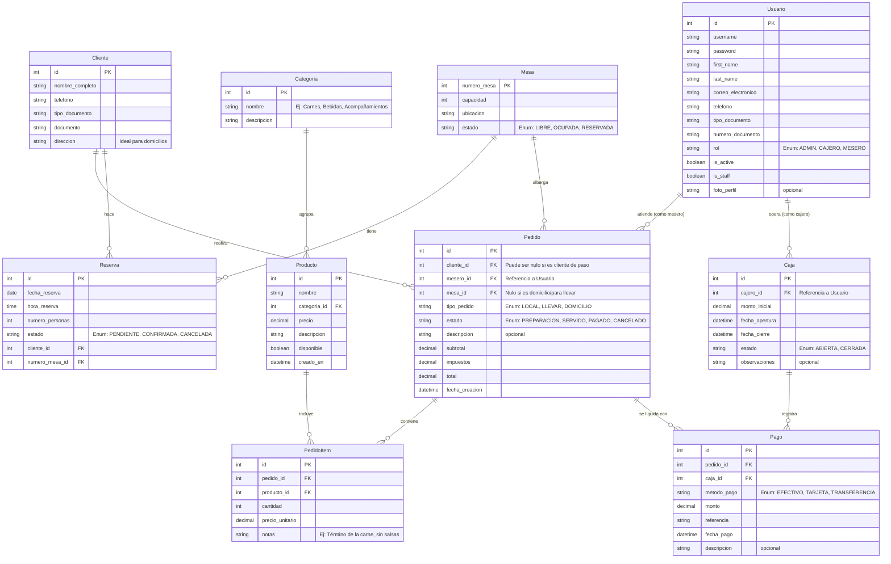

```mermaid
erDiagram
    %% Empleados y Sistema
    Usuario {
        int id PK
        string username
        string password
        string first_name
        string last_name
        string correo_electronico
        string telefono
        string tipo_documento
        string numero_documento
        string rol "Enum: ADMIN, CAJERO, MESERO"
        boolean is_active
        boolean is_staff
        string foto_perfil "opcional"
    }

    %% Comensales y Domicilios
    Cliente {
        int id PK
        string nombre_completo
        string telefono
        string tipo_documento
        string documento
        string direccion "Ideal para domicilios"
    }

    Mesa {
        int numero_mesa PK
        int capacidad
        string ubicacion
        string estado "Enum: LIBRE, OCUPADA, RESERVADA"
    }

    Reserva {
        int id PK
        date fecha_reserva
        time hora_reserva
        int numero_personas
        string estado "Enum: PENDIENTE, CONFIRMADA, CANCELADA"
        int cliente_id FK
        int numero_mesa_id FK
    }

    Categoria {
        int id PK
        string nombre "Ej: Carnes, Bebidas, Acompañamientos"
        string descripcion
    }

    Producto {
        int id PK
        string nombre
        int categoria_id FK
        decimal precio
        string descripcion
        boolean disponible
        datetime creado_en
    }

    Pedido {
        int id PK
        int cliente_id FK "Puede ser nulo si es cliente de paso"
        int mesero_id FK "Referencia a Usuario"
        int mesa_id FK "Nulo si es domicilio/para llevar"
        string tipo_pedido "Enum: LOCAL, LLEVAR, DOMICILIO"
        string estado "Enum: PREPARACION, SERVIDO, PAGADO, CANCELADO"
        string descripcion "opcional"
        decimal subtotal
        decimal impuestos
        decimal total
        datetime fecha_creacion
    }

    PedidoItem {
        int id PK
        int pedido_id FK
        int producto_id FK
        int cantidad
        decimal precio_unitario
        string notas "Ej: Término de la carne, sin salsas"
    }

    Caja {
        int id PK
        int cajero_id FK "Referencia a Usuario"
        decimal monto_inicial
        datetime fecha_apertura
        datetime fecha_cierre
        string estado "Enum: ABIERTA, CERRADA"
        string observaciones "opcional"
    }

    Pago {
        int id PK
        int pedido_id FK
        int caja_id FK
        string metodo_pago "Enum: EFECTIVO, TARJETA, TRANSFERENCIA"
        decimal monto
        string referencia
        datetime fecha_pago
        string descripcion "opcional"
    }

    %% Relaciones
    Usuario ||--o{ Pedido : "atiende (como mesero)"
    Usuario ||--o{ Caja : "opera (como cajero)"
    Cliente ||--o{ Pedido : "realiza"
    Cliente ||--o{ Reserva : "hace"
    Mesa ||--o{ Reserva : "tiene"
    Mesa ||--o{ Pedido : "alberga"
    Categoria ||--o{ Producto : "agrupa"
    Producto ||--o{ PedidoItem : "incluye"
    Pedido ||--o{ PedidoItem : "contiene"
    Pedido ||--o{ Pago : "se liquida con"
    Caja ||--o{ Pago : "registra"
```