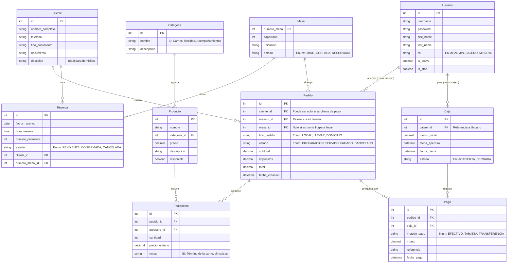

# Modelo Entidad Relación (MER) - Asadero Porras

Este documento contiene la especificación y documentación oficial del **Modelo Entidad Relación (MER) reestructurado** del sistema de información de **Asadero Porras**. Representa la arquitectura relacional optimizada para soportar la facturación local, pedidos a domicilio, control de reservas de mesas y apertura/cierre de cajas.

> [!TIP]
> Este esquema optimiza la base de datos al unificar `Pedido` y `Orden`, introducir la entidad de `Cliente` independiente para una mejor gestión de comensales y domicilios, y clasificar los productos mediante una tabla explícita de `Categoria`.

---

## 📊 Diagrama Entidad Relación (MER)

El siguiente diagrama relacional está estructurado en base a las relaciones de negocio del restaurante:

---

## 🗃️ Diccionario de Datos y Registros de Ejemplo

A continuación se detalla la especificación de tablas y los datos simulados que modelan el funcionamiento exacto de la base de datos reestructurada.

### 1. Tabla: `Usuario`
Registra a los empleados que acceden al sistema para facturar, tomar comandas u operar cajas.

| Campo | Tipo | Restricción | Ejemplo | Descripción |
| :--- | :--- | :--- | :--- | :--- |
| `id` | Integer | PK, Auto | `1` | Identificador único del empleado. |
| `username` | String | Unique | `"pedrito_mesero"` | Login del usuario. |
| `first_name` | String | - | `"Pedro"` | Nombres del empleado. |
| `last_name` | String | - | `"Gómez"` | Apellidos del empleado. |
| `rol` | String | Enum | `"MESERO"` | Rol operativo (`ADMIN`, `CAJERO`, `MESERO`). |
| `is_active` | Boolean | - | `true` | Indica si el usuario está activo. |

---

### 2. Tabla: `Cliente`
Almacena la información de contacto y entrega de los comensales (especialmente para domicilios y reservas).

| `id` (PK) | `nombre_completo` | `telefono` | `tipo_documento` | `documento` | `direccion` |
| :---: | :--- | :--- | :--- | :--- | :--- |
| `1` | `"Andrés Rojas"` | `"3204567890"` | `"CC"` | `"1057888999"` | `"Calle 15 #12-34, Sogamoso"` |
| `2` | `"María Consuelo"` | `"3118765432"` | `"CC"` | `"40012345"` | `"Carrera 11 #18-90, Sogamoso"` |

---

### 3. Tabla: `Mesa`
Mesas físicas disponibles para comensales en el restaurante.

| `numero_mesa` (PK) | `capacidad` | `ubicacion` | `estado` |
| :---: | :---: | :--- | :--- |
| `1` | `4` | `"Zona Ventana Principal"` | `"LIBRE"` |
| `2` | `8` | `"Terraza de las Flores"` | `"RESERVADA"` |
| `3` | `6` | `"Zona VIP"` | `"OCUPADA"` |

---

### 4. Tabla: `Reserva`
Control de mesas separadas por clientes para fechas y horas específicas.

| `id` (PK) | `fecha_reserva` | `hora_reserva` | `numero_personas` | `estado` | `cliente_id` (FK) | `numero_mesa_id` (FK) |
| :---: | :---: | :---: | :---: | :---: | :---: | :---: |
| `101` | `2026-05-30` | `13:00:00` | `8` | `"CONFIRMADA"` | `2` | `2` (Mesa 2) |
| `102` | `2026-05-31` | `19:30:00` | `4` | `"PENDIENTE"` | `1` | `1` (Mesa 1) |

---

### 5. Tabla: `Categoria`
Clasificación jerárquica de los platos y bebidas que componen la carta del asadero.

| `id` (PK) | `nombre` | `descripcion` |
| :---: | :--- | :--- |
| `1` | `"Carnes al Carbón"` | `"Cortes premium preparados a la brasa y leña"` |
| `2` | `"Bebidas"` | `"Gaseosas, jugos naturales y limonadas"` |
| `3` | `"Sopas"` | `"Sopas tradicionales de la casa en porciones completas o medias"` |

---

### 6. Tabla: `Producto`
Platos y consumibles individuales asociados a una categoría y precio de venta.

| `id` (PK) | `nombre` | `categoria_id` (FK) | `precio` | `descripcion` | `disponible` |
| :---: | :--- | :---: | :---: | :--- | :---: |
| `1` | `"1 Carne al Carbón"` | `1` | `$42000.00` | `"Corte selecto asado lentamente"` | `true` |
| `2` | `"Limonada de Coco"` | `2` | `$8500.00` | `"Limonada refrescante cremosa"` | `true` |
| `3` | `"Sopa de Gallina Entera"` | `3` | `$10000.00` | `"Tradicional porción completa de casa"` | `true` |

---

### 7. Tabla: `Pedido`
La comanda comercial unificada que procesa la compra, sea en mesa, a domicilio o para llevar.

| `id` (PK) | `cliente_id` (FK) | `mesero_id` (FK) | `mesa_id` (FK) | `tipo_pedido` | `estado` | `total` | `fecha_creacion` |
| :---: | :---: | :---: | :---: | :--- | :--- | :---: | :--- |
| `1001` | `2` (María) | `2` (Pedro) | `3` (Mesa 3) | `"LOCAL"` | `"SERVIDO"` | `$92500.00` | `2026-05-28 12:45:00` |
| `1002` | `1` (Andrés) | `2` (Pedro) | `null` | `"DOMICILIO"` | `"PREPARACION"`| `$50500.00` | `2026-05-28 13:10:00` |

---

### 8. Tabla: `PedidoItem`
Detalle minucioso de cada producto comisionado dentro de un pedido con sus respectivas observaciones/notas.

| `id` (PK) | `pedido_id` (FK) | `producto_id` (FK) | `cantidad` | `precio_unitario` | `notas` |
| :---: | :---: | :---: | :---: | :---: | :--- |
| `9001` | `1001` | `1` (Carne) | `2` | `$42000.00` | `"Término medio, papas cocidas"` |
| `9002` | `1001` | `2` (Limonada Coco)| `1` | `$8500.00` | `"Con poco hielo"` |
| `9003` | `1002` | `1` (Carne) | `1` | `$42000.00` | `"Bien asada, empacar por separado"` |
| `9004` | `1002` | `2` (Limonada Coco)| `1` | `$8500.00` | `""` |

---

### 9. Tabla: `Caja`
Administración diaria de la caja registradora controlando montos y estados de flujo financiero.

| `id` (PK) | `cajero_id` (FK) | `monto_inicial` | `fecha_apertura` | `fecha_cierre` | `estado` |
| :---: | :---: | :---: | :--- | :--- | :--- |
| `1` | `1` (Admin) | `$200000.00` | `2026-05-28 08:00:00` | `null` | `"ABIERTA"` |

---

### 10. Tabla: `Pago`
Registro contable de las liquidaciones de pedidos efectuadas contra una caja abierta.

| `id` (PK) | `pedido_id` (FK) | `caja_id` (FK) | `metodo_pago` | `monto` | `referencia` | `fecha_pago` |
| :---: | :---: | :---: | :--- | :---: | :--- | :--- |
| `701` | `1001` | `1` | `"EFECTIVO"` | `$92500.00` | `""` | `2026-05-28 13:40:00` |